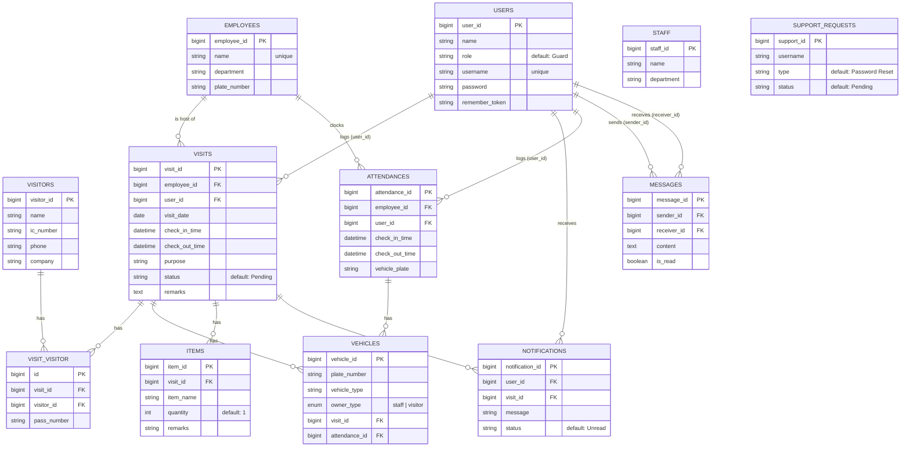

<p align="center">
    
    
    
    
</p>

# Lembah Entry — Visitor Management System

A fully-featured Visitor Management System designed for residential security operations. Guards can register visitors, track attendance, generate reports, and communicate with the System Overseer — all through a sleek, modern bento-style interface.

---

## ✨ Features

- **Visitor Registration** — Check-in/check-out with manual time override toggle
- **Staff Attendance** — Daily clock-in/clock-out tracking with calendar-based history
- **Archive & Reports** — Date-filtered logs with downloadable PDF/CSV exports
- **Internal Chat** — Real-time pseudo-live messaging between Guards and Admin
- **User Management** — Admin panel for guard credential management and password resets
- **Support Alerts** — Guards can request password resets; tickets auto-resolve on action
- **Global Notifications** — Toast popups and sidebar badges for incoming messages (with audio ping)

---

## 📋 Prerequisites

Choose **one** of the two setup methods below:

### Option A: Docker (Recommended)
- [Docker Desktop](https://www.docker.com/products/docker-desktop/) installed and running

### Option B: Local Development
- **PHP** >= 8.3
- **Composer** >= 2.x
- **Node.js** >= 20.x & **npm**
- **MySQL** 8.x (via XAMPP, WAMP, or standalone)

---

## 🐳 Getting Started — Docker

The fastest way to get up and running. No PHP, Node.js, or MySQL installation needed.

### 1. Clone the repository

```bash
git clone https://github.com/your-username/lembah-entry.git
cd lembah-entry
```

### 2. Create your environment file

```bash
cp .env.example .env
```

> The defaults in `.env.example` are pre-configured for Docker. You can adjust `DB_PASSWORD` or `APP_PORT` if needed.

### 3. Build and start containers

```bash
docker compose up --build -d
```

This will:
- Install PHP & Node.js dependencies
- Build Vite frontend assets
- Start **MySQL**, **Redis**, and the **App** containers
- Automatically run database migrations

### 4. Seed the database (first time only)

```bash
docker compose exec app php artisan db:seed
```

This creates the default Admin account:
| Field | Value |
|-------|-------|
| Username | `admin` |
| Password | `password` |

### 5. Access the application

Open your browser and navigate to:

```
http://localhost:8000
```

### Docker Commands Reference

```bash
# View real-time logs
docker compose logs -f app

# Stop all services
docker compose down

# Reset database (wipes all data)
docker compose exec app php artisan migrate:fresh --seed

# Enter the app container shell
docker compose exec app bash
```

---

## 💻 Getting Started — Local Development

For developers who want hot-reloading and a traditional dev environment.

### 1. Clone the repository

```bash
git clone https://github.com/your-username/lembah-entry.git
cd lembah-entry
```

### 2. Install dependencies

```bash
composer install
npm install
```

### 3. Configure the environment

```bash
cp .env.example .env
php artisan key:generate
```

Edit `.env` and update the database settings to match your local MySQL:

```env
DB_CONNECTION=mysql
DB_HOST=127.0.0.1
DB_PORT=3306
DB_DATABASE=vms_db
DB_USERNAME=root
DB_PASSWORD=
```

> **Note:** You must create the `vms_db` database manually in phpMyAdmin or MySQL CLI before proceeding.

### 4. Run migrations and seed

```bash
php artisan migrate
php artisan db:seed
```

### 5. Start the development servers

Open **two terminals**:

**Terminal 1 — Laravel Backend:**
```bash
php artisan serve
```

**Terminal 2 — Vite Frontend (hot-reload):**
```bash
npm run dev
```

### 6. Access the application

```
http://127.0.0.1:8000
```

---

## 🔐 Default Accounts

After seeding, the following account is available:

| Role | Username | Password |
|------|----------|----------|
| Admin | `admin` | `password` |

> Guards can be registered by the Admin through the **User Management** panel.

---

## 🗂 Project Structure

```
lembah-entry/
├── app/
│   ├── Http/Controllers/     # Laravel controllers
│   └── Models/               # Eloquent models
├── database/
│   ├── migrations/           # Database schema
│   └── seeders/              # Seed data
├── docker/                   # Docker configuration files
│   ├── entrypoint.sh         # Container startup script
│   ├── nginx.conf            # Nginx web server config
│   ├── php.ini               # PHP production settings
│   └── supervisord.conf      # Process manager config
├── resources/
│   ├── js/
│   │   ├── Components/       # Reusable Vue components
│   │   ├── Layouts/          # App layout (sidebar, nav, toasts)
│   │   └── Pages/            # Page-level Vue components
│   │       ├── Attendance/   # Staff attendance module
│   │       ├── Chat/         # Internal messaging system
│   │       ├── History/      # Archive & report viewer
│   │       ├── Users/        # Admin user management
│   │       └── Visit/        # Visitor registration
│   └── css/                  # Stylesheets
├── routes/
│   └── web.php               # Application routes
├── compose.yaml              # Docker Compose orchestration
├── Dockerfile                # Multi-stage container build
└── .env.example              # Environment template
```

---

## 🗄 Entity-Relationship Diagram

Core business tables and their relationships, derived from the migrations and Eloquent models. Laravel framework tables (`sessions`, `cache`, `cache_locks`, `password_reset_tokens`) are omitted as they are not part of the business domain.



**Notes:**
- **VISIT_VISITOR** is a many-to-many junction table between `VISITS` and `VISITORS`, carrying an extra `pass_number` attribute per pairing.
- **VEHICLES** is polymorphic-by-convention: a vehicle belongs to either a `VISIT` or an `ATTENDANCE`, distinguished by `owner_type` (`staff` | `visitor`). Both FKs are nullable and cascade-delete with their parent.
- `VISITS.employee_id` and `VISITS.user_id` are `nullOnDelete`; deleting the referenced employee/user does not delete the visit, only nulls the FK.
- `ATTENDANCES.employee_id` is `cascadeOnDelete`; `ATTENDANCES.user_id` is `nullOnDelete`.
- **STAFF** appears to be a legacy table — current attendance/visit flows use **EMPLOYEES** instead, and `STAFF` has no incoming foreign keys from active tables.
- **SUPPORT_REQUESTS** references `users.username` as a plain string column, not an enforced foreign key.

---

## 🛠 Tech Stack

| Layer | Technology |
|-------|-----------|
| **Backend** | Laravel 13, PHP 8.3 |
| **Frontend** | Vue 3, Inertia.js 2 |
| **Styling** | Tailwind CSS 3, Material Symbols |
| **Build** | Vite 8 |
| **Database** | MySQL 8.4 |
| **Cache** | Redis |
| **Containerization** | Docker, Docker Compose |
| **Web Server** | Nginx (Docker) / PHP Built-in (Local) |

---

## 📄 License

This project is open-sourced software licensed under the [MIT License](https://opensource.org/licenses/MIT).
