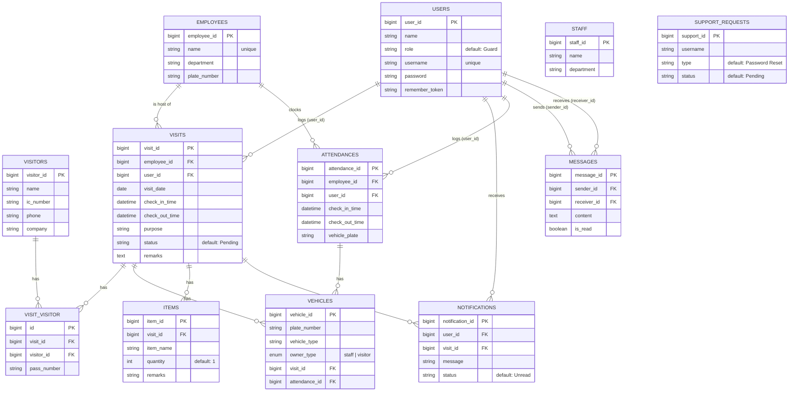

# Entity-Relationship Diagram — Lembah Entry System

Generated from current migrations + Eloquent models. Laravel framework tables
(`sessions`, `cache`, `cache_locks`, `password_reset_tokens`) are omitted as
they are not part of the business domain.

## Notes

- **VISIT_VISITOR** is a many-to-many junction table between `VISITS` and
  `VISITORS`, carrying an extra `pass_number` attribute per pairing.
- **VEHICLES** is polymorphic-by-convention: a vehicle belongs to either a
  `VISIT` or an `ATTENDANCE`, distinguished by `owner_type` (`staff` |
  `visitor`). Both FKs are nullable and cascade-delete with their parent.
- `VISITS.employee_id` and `VISITS.user_id` are `nullOnDelete`; deleting the
  referenced employee/user does not delete the visit, only nulls the FK.
- `ATTENDANCES.employee_id` is `cascadeOnDelete`; `ATTENDANCES.user_id` is
  `nullOnDelete`.
- **STAFF** appears to be a legacy table — current attendance/visit flows use
  **EMPLOYEES** instead, and `STAFF` has no incoming foreign keys from active
  tables.
- **SUPPORT_REQUESTS** references `users.username` as a plain string column,
  not an enforced foreign key.
